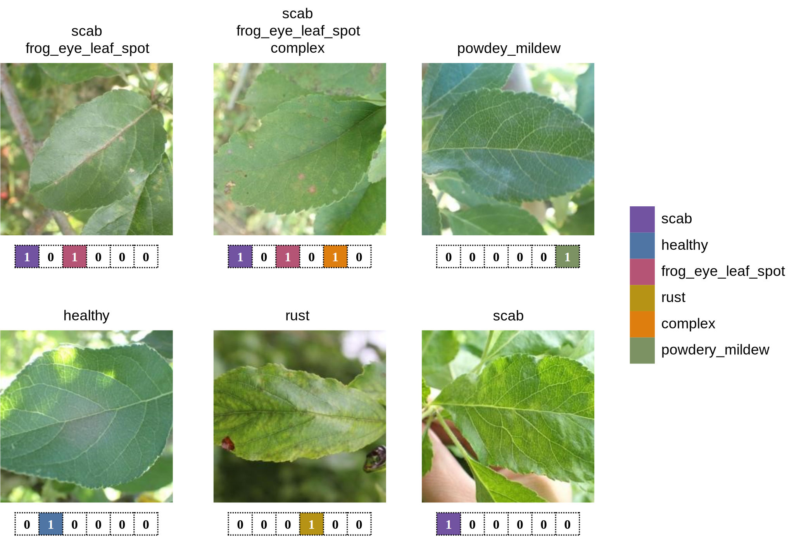
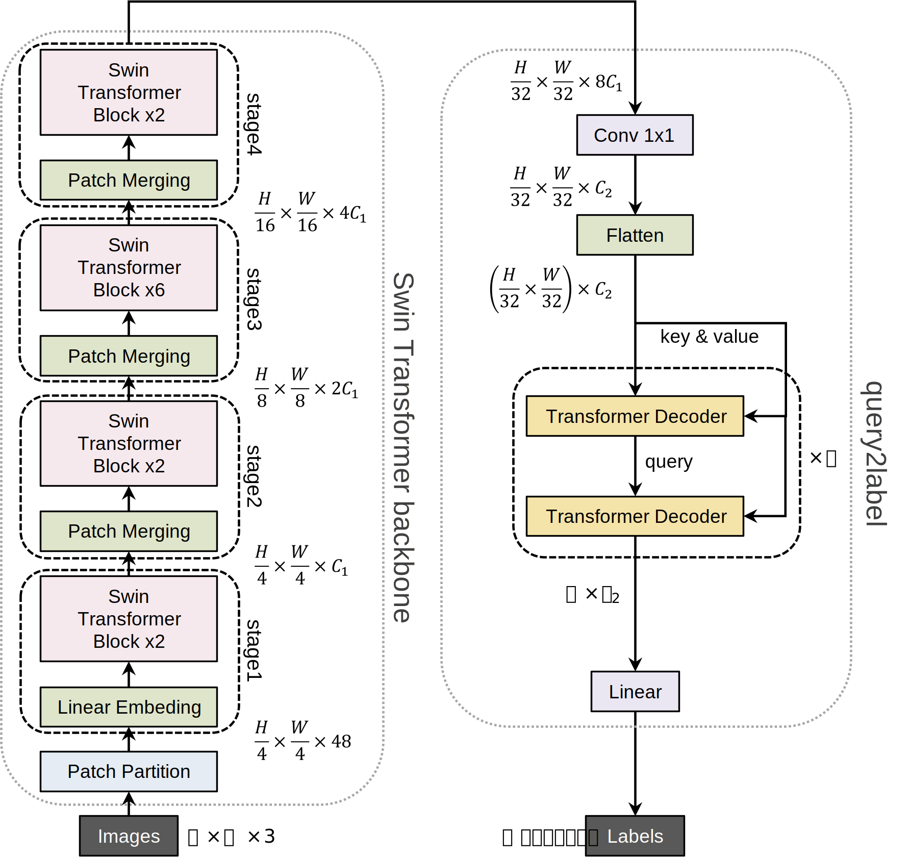
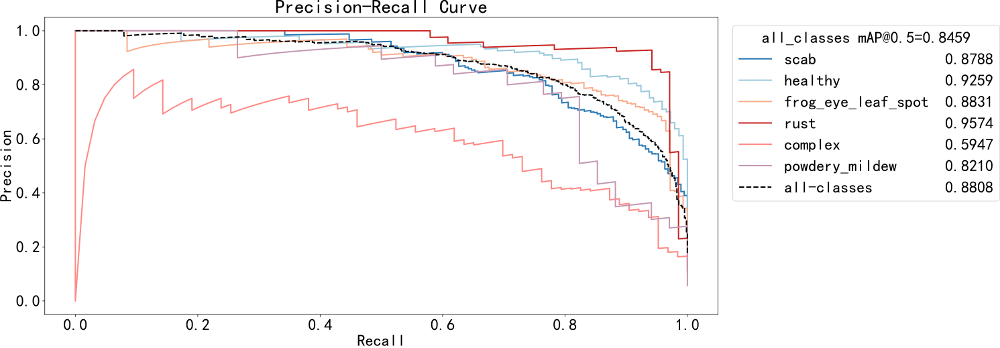
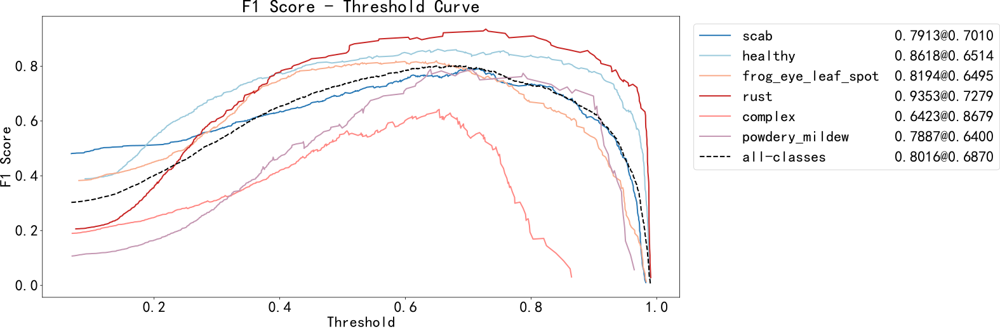
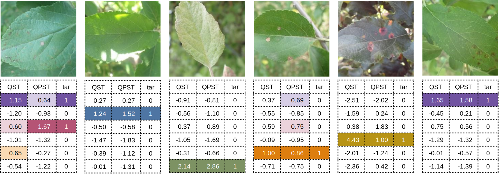

# 面向叶片分类问题的Swin-Transformer和Query2Label网络

## 简介

使用[Swin-Transformer](https://github.com/microsoft/Swin-Transformer) + [Query2Label](https://github.com/SlongLiu/query2labels)的方案解决[Plant Pathology 2021 - FGVC8](https://www.kaggle.com/c/plant-pathology-2021-fgvc8)的叶片分类问题，该方案模型可以被简称为QST。

实现路径以及代码详细解释可见博客[cleversmall](https://cleversmall.com/posts/25ec247c/)。

## 快速开始

### 下载

任务所需的[数据集](https://pan.baidu.com/s/1N10URTnXCaWbBWlRLISAWg?pwd=zvjs)和[预训练权重](https://pan.baidu.com/s/1ZcAalTIa03mzQKfTHk0fRw?pwd=48si)可以从此处下载。

### 数据集合并

由于独热编码对数据集进行了改动，故需要对仓库中的`plant_dataset`文件夹和下载所得到的`plant_dataset`文件夹进行合并，合并后的格式应该如下。

```
├─train
|  ├─images
|  ├─train_label.csv
|  ├─labels.csv
├─val
|  ├─images
|  ├─val_label.csv
|  ├─labels.csv
├─test
|  ├─images
|  ├─test_label.csv
|  ├─labels.csv
```

### 环境配置

本项目所要求的python环境并无特殊，你可以简单的在自己的torch环境中进行配置也可。

```bash
pip install -r requirements.txt
```

### 训练

```bash
python train.py --data-path <path of plant_dataset> --weights <path of your weight>
```

其中weights不进行设置则说明从随机参数开始训练。

### 预测

```bash
python predict.py --img-path <path of plant_dataset> --weights <path of your weight>
```

其在终端输出的结果例子可以是

```
tensor([[ 2.2923, -0.8050, -0.4738, -0.5310, -0.2975, -1.1503]])
tensor([[0.9082, 0.3090, 0.3837, 0.3703, 0.4262, 0.2404]])
```

两行的意思一致，分别代表了属于不同标签分类的原始概率和经过sigmoid函数后的概率，其中类别1-6分别对应的是

| scab | healthy | frog_eye_leaf_spot | rust | complex | powdery_mildew |
| :--: | :-----: | :----------------: | :--: | :-----: | :------------: |

则说明该叶片最可能属于scab。

## 方法概述

### 编码方式

在进行输入前，首先需要将12类的混合分类简化为6类，这会导致多标签的情况，故使用独热码对标签进行分类。



### 模型搭建

模型即使用最基本的SwinTransformer并在后端加入Query2Label以优化多标签分类结果。



### 性能指标

PR曲线



F1分数曲线



### 预测结果


